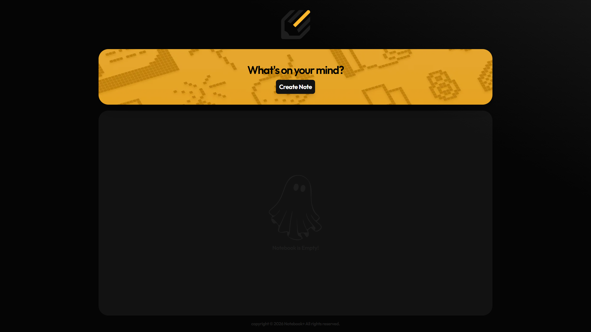
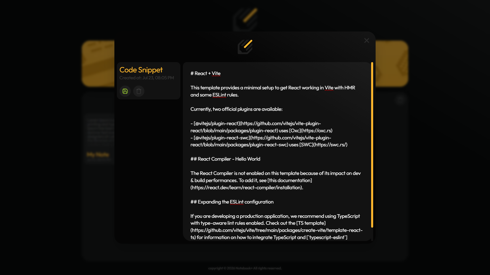
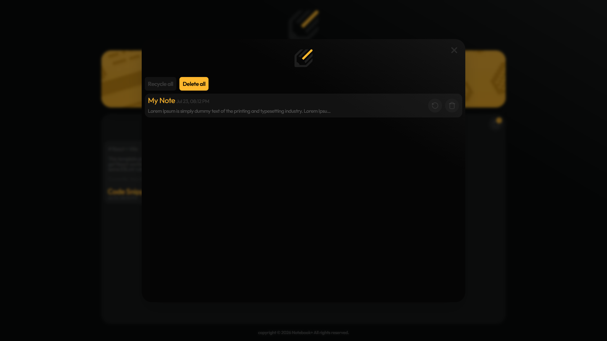

<div align="center">

# 📝 Notebook+

**A modern, lightweight note-taking application built with React & Tailwind CSS**

[](https://react.dev/)
[](https://vitejs.dev/)
[](https://tailwindcss.com/)
[](#license)

[Live Demo](https://notebookplus.vercel.app) · [Report a Bug](https://github.com/mdalbakiakon/notebook-plus/issues) · [Request a Feature](https://github.com/mdalbakiakon/notebook-plus/issues)

</div>

---

## 📖 About

**Notebook+** is a note management application built for a clean, fast, and distraction-free writing experience. It lets users create, edit, organize, delete, and restore notes — all backed by persistent local browser storage, with no account or external database required.

The project emphasizes a component-driven architecture, responsive design, and a smooth, optimized user experience.

**🔗 Live Application:** [notebookplus.vercel.app](https://notebookplus.vercel.app)

---

## ✨ Features

### Note Management
- Create notes instantly
- Edit existing notes
- Preserve original creation timestamps
- Delete notes using a safe trash system
- Restore deleted notes
- Permanently remove unwanted notes

### Data Persistence
- Browser-based Local Storage integration
- Notes remain available after refreshing
- No backend dependency required
- Fast, offline-friendly experience

### User Experience
- Modern dark-themed interface
- Fully responsive layout
- Smooth modal interactions
- Real-time validation feedback
- Clean, minimal writing environment

### Performance
- Optimized WebP image assets
- Priority loading for key visual elements
- Lightweight React component architecture
- Efficient state management
- Fast client-side rendering

---

## 📸 Screenshots

| Home Dashboard | Note Editor | Trash Management |
|---|---|---|
|  |  |  |

---

## 🛠️ Tech Stack

| Technology | Purpose |
|---|---|
| **React 18** | Component-based UI development |
| **Vite** | Fast development and build tooling |
| **Tailwind CSS** | Responsive styling framework |
| **JavaScript (ES6+)** | Application logic |
| **Local Storage API** | Persistent client-side data |

---

## 🏗️ Architecture

Notebook+ follows a modular React component architecture, keeping features isolated, maintainable, and easy to extend.

| Component | Responsibility |
|---|---|
| `Navbar` | Application navigation |
| `Banner` | Hero section and note creation |
| `Noteform` | Creating new notes |
| `Notecontainer` | Displaying saved notes |
| `Noteopen` | Editing existing notes |
| `Trashopen` | Deleted note management |
| `Footer` | Application footer |

### Data Flow

```
User Action
     │
     ▼
React State Update
     │
     ▼
Local Storage Sync
     │
     ▼
Persistent Notes
```

This flow keeps the application fast and responsive while remaining fully client-side.

---

## 📦 Getting Started

### Prerequisites

- [Node.js](https://nodejs.org/) 18+
- npm
- Git

### Installation

1. Clone the repository
   ```bash
   git clone https://github.com/mdalbakiakon/notebook-plus.git
   ```

2. Navigate to the client folder
   ```bash
   cd client
   ```

3. Install dependencies
   ```bash
   npm install
   ```

4. Start the development server
   ```bash
   npm run dev
   ```

5. Open the app in your browser
   ```
   http://localhost:5173
   ```

---

## 🚀 Roadmap

- [ ] User authentication
- [ ] Cloud synchronization
- [ ] Markdown editor
- [ ] Note search functionality
- [ ] Categories and tags
- [ ] Backend database support
- [ ] Multi-device synchronization

---

## 🤝 Contributing

Contributions and suggestions are welcome! To contribute:

1. Fork the repository
2. Create a feature branch
   ```bash
   git checkout -b feature/new-feature
   ```
3. Commit your changes
   ```bash
   git commit -m "Add new feature"
   ```
4. Push your branch
   ```bash
   git push origin feature/new-feature
   ```
5. Open a Pull Request

---

## 📄 License

This project is licensed under the [MIT License](LICENSE).

---

## 👨‍💻 Author

**Md. Al Baki Akon**

- GitHub: [@mdalbakiakon](https://github.com/mdalbakiakon)
- LinkedIn: [Md. Al Baki Akon](https://www.linkedin.com/in/md-al-baki-akon-352989362/)

---

<div align="center">

⭐ If you found this project useful, consider giving it a star!

</div>